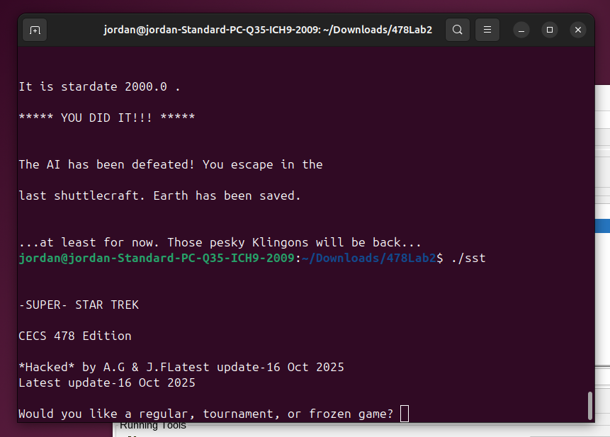

# Super Star Trek: Binary Exploitation & Control Flow Patching

A technical demonstration of reverse engineering, dynamic analysis, and binary instrumentation using a legacy C implementation of the strategy game *Super Star Trek*. 

## 🎯 Overview
In this scenario, a sentient AI has seized control of the Starship Enterprise. To prevent a catastrophic failure, the "Self-Destruct" authentication sequence must be bypassed. This project involves identifying runtime-generated security keys and patching compiled machine code to alter the program's logical execution flow.

## 🛠️ Tools Used
* **Ghidra:** Disassembled and decompiled the ELF/Mach-O binaries to map control flow.
* **GDB:** Performed dynamic analysis to track register values and memory states during execution.
* **Hex Editor:** Manually modified instruction opcodes and data section strings.

## 🔍 Technical Analysis & Discovery

### 1. Runtime Password Extraction
Initial static analysis of the `dsetrct` (Destruct) function pointed to an empty variable `citem`, suggesting the password was not stored in plaintext. Further investigation of cross-references for the `ffzagg` variable led to the `choose` function.

* **Observation:** The function assigned a hex value: `0x7270706865637267`.
* **Decoding:** By reversing the little-endian bytes (`67 72 63 65 68 70 70 72`), the ASCII password was revealed as `grcehppr`.

### 2. Control Flow Patching
The authentication logic relied on a `JNZ` (Jump if Not Zero) instruction at offset `00402b5d` to redirect the user to a "PASSWORD REJECTED" state.

* **The Patch:** To bypass this, the 6-byte instruction (`0f 85 ab 00 00 00`) was neutralized.
* **Implementation:** A **NOP Sled** (`90 90 90 90 90 90`) was applied. This forces the CPU to "slide" through the check and land directly in the "PASSWORD ACCEPTED" routine regardless of the user's input.

### 3. Binary Instrumentation
In addition to logic bypassing, the binary's data section was modified at offset `0041e154` to update the software credits while maintaining strict memory alignment and length.

## 🖼️ Proof of Concept

---
*Disclaimer: This project was conducted in a controlled environment for educational purposes in cybersecurity and software instrumentation.*
